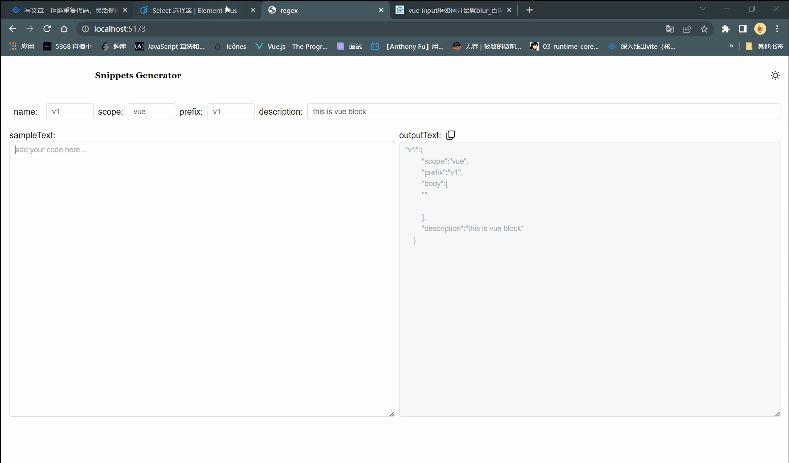
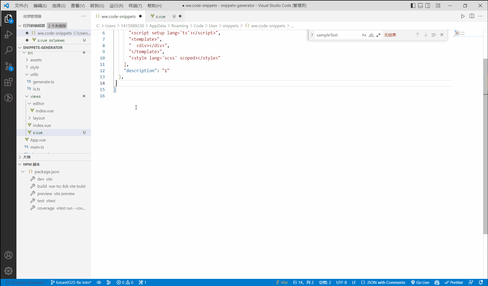

# Snippets Generator

Run your project:

1、npm install

2、npm run dev

3、copy your code ,paste to sampleText(cursor), and then copy the result at outputText

4、paste to vscode snippets json, good luck to you !

